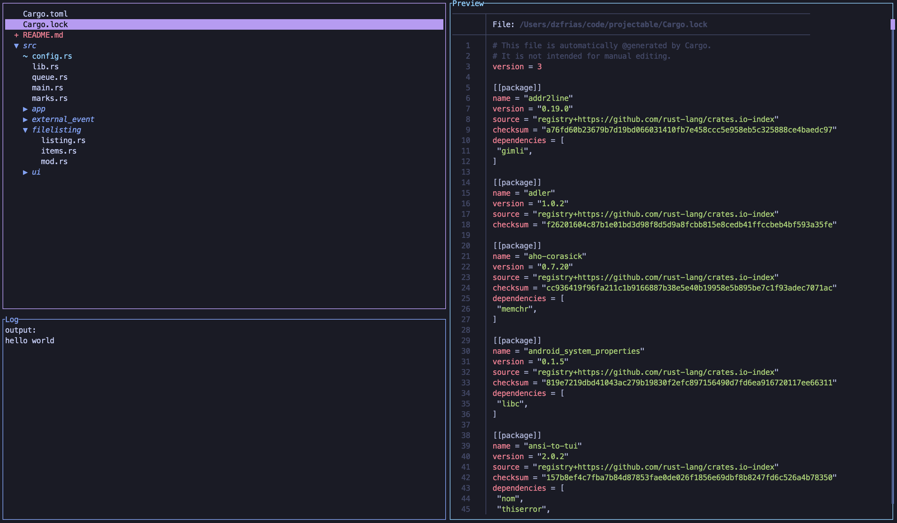

# 💫 projectable



<p><sub>Preview done with <a href="https://github.com/sharkdp/bat">bat</a></sub></p>

**projectable** is a highly configurable TUI project manager. You can do _everything_
your project needs from a comfortable and smooth interface.

Instead of exploring the depths of your most nested directory, open a file simply
from the projectable file listing!

Here are just a few builtin things projectable can do:

- 🔍 Preview files
- 💥 Run commands, foreground or background
- 👀 Fuzzy search files
- 📁 Create files or directories
- ❌ Delete files or directories
- 🙈 Ignore files based on glob patterns
- 🔳 Toggle hidden files
- 🎯 Mark files to quick and easy access
- 🙉 Respect gitignore
- 🔔 Live update to new files/changes
- 🌲 View your project as a hierarchy
- 🔦 Automatically recognize project root, with customizability
- 💼 Run special commands that change on a per-file basis
- 👓 View git changes
- ✏️ Easily write custom commands
- 📖 Fully configurable with a dead-simple `toml` file

## 🚀 Getting Started

To get started, you can use one of the following installation methods:

<details>
  <summary>cargo</summary>

```bash
$ cargo install projectable
```

</details>

<details>
  <summary>Homebrew</summary>

```bash
$ cargo install dzfrias/formulae/projectable
```

</details>

<details>
  <summary>Releases</summary>

Go to the releases page, and binaries for every major platform should be there.

</details>

<details>
  <summary>Build from source</summary>

Requires [Rust](https://github.com/rust-lang/rust) to be installed on your
computer.

```bash
$ git clone https://github.com/dzfrias/projectable
$ cd projectable
$ cargo build --release
$ ./target/release/prj
```

</details>

To verify installation worked correctly, run `prj --version`.

After you've installed, run `prj` to start it up! The default keybinds are
vim-like (k for up, j for down), but you can change them in
[CONFIG.md](./extras/CONFIG.md).

## ⌨️ Keybinds

Here a list of the available actions and their default bindings. For
customization, see [CONFIG.md](./extras/CONFIG.md).

| Key       | Description                                     |
| --------- | ----------------------------------------------- |
| `j`       | Go down                                         |
| `k`       | Go up                                           |
| `enter`   | Open file or directory                          |
| `q`/`esc` | Quit                                            |
| `o`       | Expand all                                      |
| `O`       | Collapse all                                    |
| `g`       | Go to first                                     |
| `G`       | Go to last                                      |
| `l`       | Expand all under directory                      |
| `h`       | Collapse all under directory                    |
| `n`       | New file                                        |
| `N`       | New directory                                   |
| `d`       | Delete file/directory                           |
| `r`       | Rename/move file                                |
| `e`       | Execute command (see [syntax](#command-syntax)) |
| `ctrl-c`  | Cancel command(s)                               |
| `v`       | File-specific command                           |
| `ctrl-n`  | Go down by three                                |
| `ctrl-p`  | Go up by three                                  |
| `/`       | Search                                          |
| `ctrl-d`  | Move preview down                               |
| `ctrl-u`  | Move preview up                                 |
| `t`       | Toggle git diff view                            |
| `T`       | Filter for modified files                       |
| `.`       | Toggle hidden files                             |
| `m`       | Mark file                                       |
| `M`       | Open marks                                      |

You can make your own keybinds, too! This is of course done in the configuration
file, the details of which can be found in [CONFIG.md](./extras/CONFIG.md).

### Command Syntax

The execute command action has some extra features that allow for easy and
dynamic command execution.

By default commands are run in the background, but this behavior can be changed,
so interactive programs like [fzf](https://github.com/junegunn/fzf) work. In the
command execution window, prepend `!!` to execute in the foreground. For example,
`!!fzf` will execute `fzf`.

Additionally, use `{}` to interpolate the currently selected file into your
command. `echo {}` would log the file you are currently selecting.

Lastly, `{...}` will prompt you for input. This is only available in custom
commands defined in the config file. So, if you've defined a custom command
bound to `ctrl-b` that executes `cargo add {...}`, pressing `ctrl-b` will prompt
you for something to `cargo add`.

There are also keybinds that integrate with [tmux](https://github.com/tmux/tmux).
When entering input to run a command, press `ctrl-v` to open a vertical split.
`ctrl-x` will open a horizontal one, `ctrl-n` a new window, and `ctrl-f` a
floating one.

In short:

| Item     | Description               |
| -------- | ------------------------- |
| `!!`     | Execute in foreground     |
| `{}`     | Interpolate selected file |
| `{...}`  | Prompt for input          |
| `ctrl-v` | Vertical split            |
| `ctrl-x` | Horizontal split          |
| `ctrl-n` | New window                |
| `ctrl-f` | Floating window           |

## ✍️ License

This project is licensed under the [MIT License](./LICENSE).
